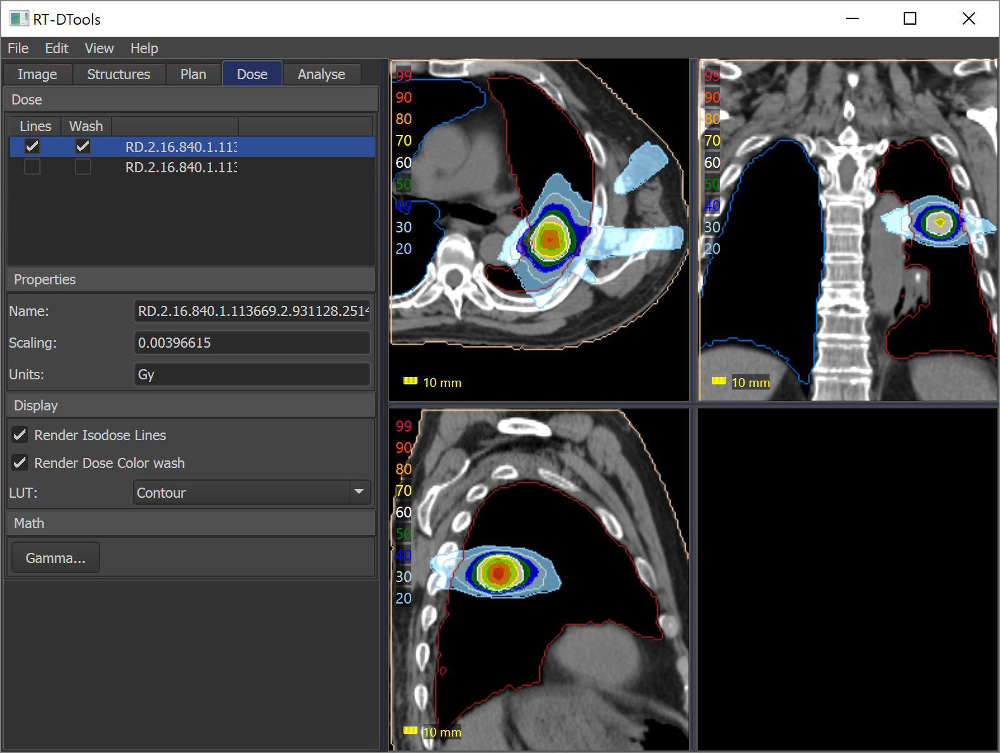
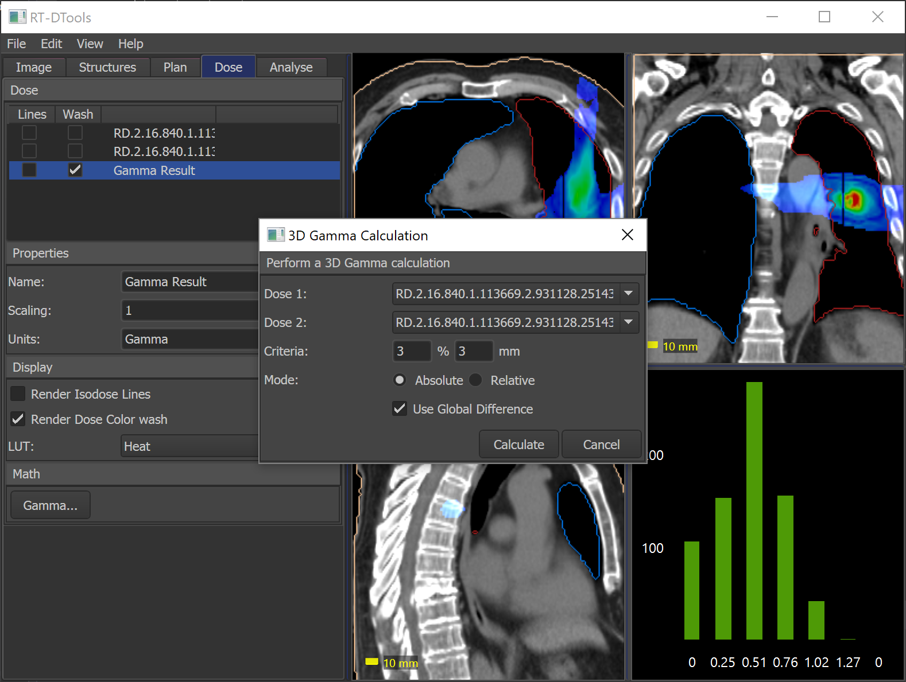
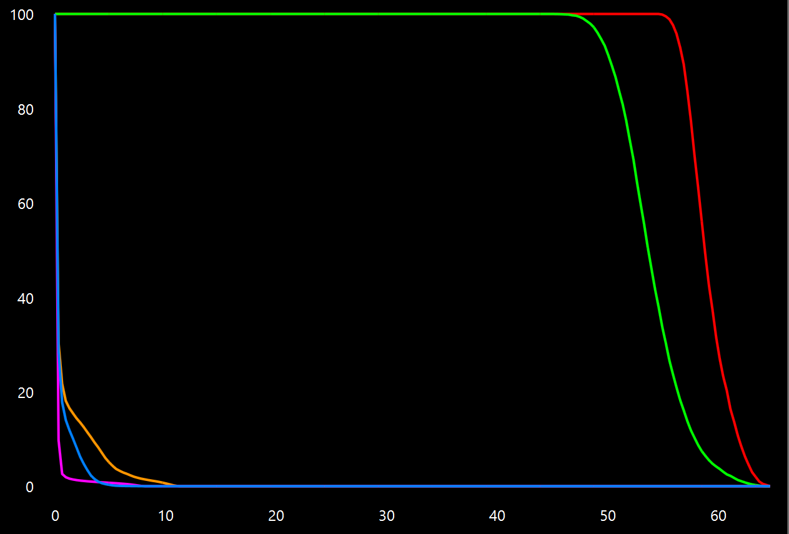

RT-DTools: Radiotherapy Dose Tools
====================================

This repository consists of a suite of tools for viewing and analysing radiotherapy images, dose distributions and structure sets. The majority of the software is written in C# using WPF.

## Features
* Open and view RT DICOM files (Dicom Image, RTStruct, RTDose)
* Import and display .3ddose files
* Display multiple dose distributions on the same image.
* Compute, display and export DVH
* Perform and view 3D gamma analysis

## Dependencies
* [Fellow Oak DICOM](https://github.com/fo-dicom/fo-dicom)
* [Oxyplot](https://github.com/oxyplot/oxyplot)
* [MVVMLight](https://github.com/lbugnion/mvvmlight)

## Screenshots

